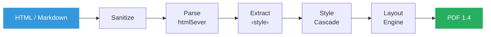

# ironpress

[](https://crates.io/crates/ironpress)
[](https://www.npmjs.com/package/ironpress)
[](https://docs.rs/ironpress)
[](https://github.com/gastongouron/ironpress/actions)
[](https://codecov.io/gh/gastongouron/ironpress)
[](LICENSE)
[](#wasm)
[](https://crates.io/crates/ironpress)
[](https://gastongouron.github.io/ironpress/)
[](https://gastongouron.github.io/ironpress/parity/)

Pure Rust HTML/CSS/Markdown to PDF converter. No browser, no system dependencies.

**[Try it in your browser](https://gastongouron.github.io/ironpress/)** - the playground runs 100% client-side via WebAssembly.

**[Parity dashboard](https://gastongouron.github.io/ironpress/parity/)** - visual comparison of ironpress vs Chromium rendering across 24 test fixtures.

Other Rust PDF crates shell out to headless Chrome or wkhtmltopdf. ironpress does it natively with a built-in layout engine. No C libraries, no binaries to install, just `cargo add ironpress`.

### Performance

Benchmarked on Apple M4 (release build, `cargo bench`):

| Document | Time | Pages/sec |
|----------|------|-----------|
| Simple HTML (`<h1>` + `<p>`) | **16 us** | 62,500 |
| Styled HTML (CSS, lists, links) | **71 us** | 14,000 |
| Markdown (headings, code, lists) | **141 us** | 7,000 |
| Table (5 rows, styled headers) | **341 us** | 2,900 |
| Full report (tables, flex, progress bars) | **587 us** | 1,700 |

For comparison, Chrome headless takes ~2,500 ms per page - **ironpress is 4,000x faster**.

## Table of Contents

- [Quick Start](#quick-start)
- [CLI](#cli)
- [API Reference](#api-reference)
- [Markdown to PDF](#markdown-to-pdf)
- [Math (LaTeX)](#math-latex)
- [HTML Elements](#html-elements)
- [CSS Support](#css-support)
- [Images](#images)
- [SVG](#svg)
- [Tables](#tables)
- [Fonts](#fonts)
- [Streaming Output](#streaming-output)
- [Async API](#async-api)
- [Remote Resources](#remote-resources)
- [Security](#security)
- [How It Works](#how-it-works)
- [WASM](#wasm)
- [Testing](#testing)
- [License](#license)

## Quick Start

```rust
use ironpress::html_to_pdf;

let pdf_bytes = html_to_pdf("<h1>Hello</h1><p>World</p>").unwrap();
std::fs::write("output.pdf", pdf_bytes).unwrap();
```

## CLI

Install the CLI with Cargo:

```bash
cargo install ironpress
```

Convert HTML or Markdown files to PDF:

```bash
ironpress input.html output.pdf
ironpress document.md output.pdf
```

With options:

```bash
ironpress --page-size letter --landscape --margin 54 input.html output.pdf
ironpress --header "My Report" --footer "Page {page} of {pages}" input.html output.pdf
```

Pipe from stdin:

```bash
echo '<h1>Hello</h1>' | ironpress --stdin output.pdf
curl -s https://example.com | ironpress --stdin page.pdf
```

Run `ironpress --help` for all options.

## API Reference

### One-liner functions

```rust
// HTML string to PDF bytes
let pdf = ironpress::html_to_pdf("<h1>Title</h1><p>Content</p>").unwrap();

// Markdown string to PDF bytes
let pdf = ironpress::markdown_to_pdf("# Title\n\nContent").unwrap();

// HTML file to PDF file
ironpress::convert_file("input.html", "output.pdf").unwrap();

// Markdown file to PDF file
ironpress::convert_markdown_file("input.md", "output.pdf").unwrap();
```

### Builder API

```rust
use ironpress::{HtmlConverter, PageSize, Margin};

let pdf = HtmlConverter::new()
    .page_size(PageSize::LETTER)        // default: A4
    .margin(Margin::uniform(54.0))      // default: 72pt (1 inch)
    .sanitize(false)                    // default: true
    .header("My Document")              // optional page header
    .footer("Page {page} of {pages}")   // optional page footer
    .convert("<h1>Custom page</h1>")
    .unwrap();
```

Headings (`<h1>` through `<h6>`) are automatically added as PDF bookmarks/outlines, visible in the sidebar of most PDF readers.

### Custom fonts

```rust
use ironpress::HtmlConverter;

let ttf_data = std::fs::read("fonts/MyFont.ttf").unwrap();
let pdf = HtmlConverter::new()
    .add_font("MyFont", ttf_data)
    .convert(r#"<p style="font-family: MyFont">Custom font text</p>"#)
    .unwrap();
```

### Page sizes

```rust
use ironpress::PageSize;

PageSize::A4         // 595.28 x 841.89 pt (default)
PageSize::LETTER     // 612.0 x 792.0 pt
PageSize::LEGAL      // 612.0 x 1008.0 pt
PageSize::new(width_pt, height_pt)  // custom
```

### Margins

```rust
use ironpress::Margin;

Margin::default()                    // 72pt on all sides (1 inch)
Margin::uniform(54.0)               // same value on all sides
Margin::new(top, right, bottom, left)  // individual values in pt
```

## Markdown to PDF

[CommonMark](https://commonmark.org/)-compliant Markdown parser powered by [pulldown-cmark](https://crates.io/crates/pulldown-cmark).

```rust
let pdf = ironpress::markdown_to_pdf(r#"
# Project Title

Some **bold** and *italic* text with `inline code`.

## Features

- Item one
- Item two
- Item three

1. First
2. Second

> A wise quote

---

[Link text](https://example.com)
"#).unwrap();
```

Full [CommonMark](https://spec.commonmark.org/) support including headings, emphasis, inline code, fenced code blocks, links, images, lists (nested), blockquotes, horizontal rules, and raw HTML passthrough. GFM extensions are enabled: tables, strikethrough (`~~deleted~~`), task lists, and footnotes.

## Math (LaTeX)

Publication-quality mathematical typesetting with LaTeX syntax, rendered directly to PDF using TeX layout rules.

**Inline math** with `$...$`:

```markdown
The equation $E = mc^2$ is famous.
```

**Display math** with `$$...$$`:

```markdown
$$\frac{-b \pm \sqrt{b^2 - 4ac}}{2a}$$
```

```rust
let pdf = ironpress::markdown_to_pdf(r#"
# Gauss's Identity

For all $n \geq 1$:

$$\sum_{k=1}^{n} k = \frac{n(n+1)}{2}$$

The integral $\int_0^\infty e^{-x^2}\,dx = \frac{\sqrt{\pi}}{2}$.
"#).unwrap();
```

**Also works via HTML** with `data-math` attribute:

```html
<span class="math-inline" data-math="x^2">x^2</span>
<div class="math-display" data-math="\frac{a}{b}">\frac{a}{b}</div>
```

### Supported LaTeX

| Category | Examples |
|----------|---------|
| Scripts | `x^2`, `a_{ij}`, `x^{2}_{n}` |
| Fractions | `\frac{a}{b}`, `\dfrac{}{}` |
| Roots | `\sqrt{x}`, `\sqrt[3]{x}` |
| Greek | `\alpha` ... `\omega`, `\Gamma` ... `\Omega` |
| Operators | `\sum`, `\prod`, `\int`, `\oint`, `\bigcup`, `\bigcap` |
| Functions | `\sin`, `\cos`, `\log`, `\lim`, `\exp`, `\det`, `\min`, `\max` |
| Relations | `\leq`, `\geq`, `\neq`, `\approx`, `\equiv`, `\in`, `\subset` |
| Arrows | `\to`, `\Rightarrow`, `\Leftrightarrow`, `\mapsto` |
| Delimiters | `\left( \right)`, `\left[ \right]`, `\left\{ \right\}` |
| Accents | `\hat{x}`, `\bar{x}`, `\vec{v}`, `\dot{x}`, `\tilde{x}` |
| Spacing | `\,`, `\;`, `\quad`, `\qquad` |
| Matrices | `\begin{pmatrix}a & b \\\\ c & d\end{pmatrix}` |
| Text | `\text{...}`, `\mathrm{...}` |
| Misc | `\infty`, `\partial`, `\nabla`, `\forall`, `\exists`, `\emptyset` |

Layout follows TeX conventions: 4 style levels (display, text, script, scriptscript), Knuth's inter-atom spacing matrix, proper fraction bars, and baseline alignment for inline math.

## HTML Elements

| Category | Elements |
|----------|----------|
| Headings | `<h1>` through `<h6>` with default sizes and bold |
| Block containers | `<p>`, `<div>`, `<blockquote>`, `<pre>`, `<figure>`, `<figcaption>`, `<address>` |
| Semantic sections | `<section>`, `<article>`, `<nav>`, `<header>`, `<footer>`, `<main>`, `<aside>`, `<details>`, `<summary>` |
| Inline formatting | `<strong>`, `<b>`, `<em>`, `<i>`, `<u>`, `<small>`, `<sub>`, `<sup>`, `<code>`, `<abbr>`, `<span>` |
| Text decoration | `<del>`, `<s>` (strikethrough), `<ins>` (underline), `<mark>` (highlight) |
| Form controls | `<input>`, `<select>`, `<textarea>` with static visual rendering (borders, value/placeholder text) |
| Media | `<video>`, `<audio>` rendered as placeholder rectangles with play icon |
| Gauges | `<progress>`, `<meter>` with filled bar (meter supports `low`/`high` color thresholds) |
| Links | `<a>` with clickable PDF link annotations |
| Images | `` with JPEG and PNG support (data URIs, local files, remote URLs) |
| SVG | Inline `<svg>` with `<rect>`, `<circle>`, `<ellipse>`, `<line>`, `<polyline>`, `<polygon>`, `<path>`, `<g>`, transforms, viewBox |
| Line breaks | `<br>`, `<hr>` |
| Lists | `<ul>`, `<ol>` with nested support, `<li>`, `<dl>`, `<dt>`, `<dd>` |
| Tables | `<table>`, `<thead>`, `<tbody>`, `<tfoot>`, `<tr>`, `<td>`, `<th>`, `<caption>` with colspan, rowspan, auto-sized columns, and cell borders |

## CSS Support

### Properties

| Category | Properties |
|----------|-----------|
| Typography | `font-size`, `font-weight`, `font-style`, `font-family`, `letter-spacing`, `word-spacing`, `text-indent`, `text-transform`, `white-space`, `vertical-align`, `text-overflow`, `overflow-wrap` |
| Colors | `color`, `background-color`, `opacity` |
| Box model | `margin` (including `auto`), `padding`, `border`, `border-top/right/bottom/left`, `border-width`, `border-color`, `border-radius`, `outline`, `outline-width`, `outline-color`, `box-sizing`, `width`, `height`, `min-width`, `min-height`, `max-width`, `max-height` |
| Layout | `text-align` (left, center, right, justify), `line-height`, `display` (none, block, inline, flex, grid), `float` (left, right), `clear`, `position` (static, relative, absolute), `z-index` |
| Flexbox | `flex-direction`, `justify-content`, `align-items`, `flex-wrap`, `flex-grow`, `flex-shrink`, `flex-basis`, `flex` (shorthand), `gap` |
| Grid | `grid-template-columns` (fixed, `fr`, `auto`, `repeat()`, `minmax()`, `auto-fill`, `auto-fit`), `grid-gap` |
| Multi-column | `column-count`, `columns`, `column-gap` |
| Positioning | `top`, `left`, `z-index` |
| Visual effects | `box-shadow`, `transform` (rotate, scale, translate), `overflow` (visible, hidden), `visibility`, `filter` (`blur()`) |
| Backgrounds | `background` (shorthand), `background-color`, `background-image` (SVG data URIs, raster images), `background-position`, `background-size`, `background-repeat`, `background-origin`, `linear-gradient()`, `radial-gradient()` |
| Decoration | `text-decoration` (underline, line-through) |
| Lists | `list-style-type` (disc, circle, square, decimal, lower-alpha, upper-alpha, lower-roman, upper-roman, none), `list-style-position` (inside, outside) |
| Tables | `border-collapse`, `border-spacing`, `table-layout` (auto, fixed) |
| Counters | `counter-reset`, `counter-increment`, `content: counter()` |
| Pseudo-elements | `::before`, `::after` with `content` property |
| Custom properties | `--my-var: value`, `var(--my-var)`, `var(--my-var, fallback)` |
| Functions | `calc()` (with `+`, `-`, `*`, `/` and mixed units) |
| Page control | `page-break-before`, `page-break-after`, `@page` (size, margin) |

All shorthand properties are supported. Margin and padding accept 1, 2, 3, or 4 values. Border accepts `width style color` shorthand.

### `<style>` blocks

```html
<style>
  p { color: navy; font-size: 14pt }
  .highlight { background-color: yellow; font-weight: bold }
  #title { font-size: 24pt }
  h1, h2 { color: darkblue }

  @media print {
    .screen-only { display: none }
  }
</style>
```

### Selectors

| Type | Example |
|------|---------|
| Tag | `p`, `h1`, `div` |
| Class | `.highlight`, `.intro` |
| ID | `#title`, `#nav` |
| Combined | `p.highlight`, `div#main` |
| Comma-separated | `h1, h2, h3` |
| Descendant | `div p`, `article h2` |
| Child | `div > p`, `ul > li` |
| Adjacent sibling | `h1 + p` |
| General sibling | `h1 ~ p` |
| Attribute | `[href]`, `[type="text"]` |
| Pseudo-class | `:first-child`, `:last-child`, `:nth-child()`, `:not()` |
| Pseudo-element | `::before`, `::after` |

### Values

| Type | Examples |
|------|---------|
| Colors | `red`, `navy`, `darkblue`, `#f00`, `#ff0000`, `rgb(255, 0, 0)` |
| Units | `12pt`, `16px`, `1.5em`, `50%`, `2rem`, `10vw`, `5vh` |
| Functions | `calc(100% - 20pt)`, `var(--my-color)`, `var(--size, 12pt)` |
| Keywords | `bold`, `italic`, `center`, `justify`, `none`, `inherit`, `initial`, `unset` |

### Media queries

`@media print` and `@media all` rules are applied (since PDF is print output). `@media screen` rules are ignored. Page-aware conditions are supported:

```css
@media (orientation: portrait) { /* matches when page height > width */ }
@media (orientation: landscape) { /* matches when page width > height */ }
@media (min-width: 600pt) { /* matches when page width >= 600pt */ }
@media print and (orientation: landscape) { /* compound queries with and */ }
```

Supported features: `orientation`, `min-width`, `max-width`, `min-height`, `max-height`. Units: `pt`, `px`, `mm`, `in`.

### `@page` rule

Control page size and margins from CSS:

```html
<style>
  @page { size: letter landscape; margin: 0.5in; }
</style>
```

Supported values: `A4`, `letter`, `legal`, `landscape`, custom dimensions (`210mm 297mm`), and individual margins.

## Images

JPEG and PNG images are supported via data URIs, local file paths, and remote URLs.

```html
<!-- Data URI -->


<!-- Remote URL (requires "remote" feature) -->


<!-- Local file -->

```

Images are embedded directly in the PDF. JPEG uses DCTDecode, PNG uses FlateDecode with PNG predictors. Width and height attributes are converted from px to pt.

## SVG

Inline SVG elements are rendered as vector graphics directly in the PDF (not rasterized):

```html
<svg width="200" height="200" viewBox="0 0 100 100">
  <rect x="10" y="10" width="80" height="80" fill="#e74c3c" stroke="#333" stroke-width="2"/>
  <circle cx="50" cy="50" r="30" fill="#3498db"/>
  <path d="M 20 80 L 50 20 L 80 80 Z" fill="#2ecc71"/>
  <g transform="translate(50, 50) rotate(45)">
    <rect x="-10" y="-10" width="20" height="20" fill="#f39c12"/>
  </g>
</svg>
```

Supported elements: `<rect>`, `<circle>`, `<ellipse>`, `<line>`, `<polyline>`, `<polygon>`, `<path>` (full path command set: M, L, H, V, C, S, Q, T, A, Z with relative variants), `<g>` groups with `transform` (translate, scale, rotate, matrix), `<text>` with style inheritance, `<image>` with embedded raster data, `<use>` references (depth-limited), `<defs>` with `<linearGradient>` and `<clipPath>`, and `viewBox` scaling with `preserveAspectRatio`.

SVG can also be used as a CSS background via `background-image: url("data:image/svg+xml;...")` or inline data URIs.

SVG content is automatically sanitized: `<script>`, `<foreignObject>`, and event handlers are stripped.

## Tables

Full table support with sections, spanning, auto-sized columns, and styling.

```html
<table>
  <thead>
    <tr><th>Name</th><th>Role</th><th>Status</th></tr>
  </thead>
  <tbody>
    <tr>
      <td rowspan="2">Alice</td>
      <td>Engineer</td>
      <td>Active</td>
    </tr>
    <tr>
      <td colspan="2">On project X</td>
    </tr>
    <tr>
      <td>Bob</td>
      <td>Designer</td>
      <td>Active</td>
    </tr>
  </tbody>
</table>
```

Column widths are automatically calculated based on content. Features: `<thead>`, `<tbody>`, `<tfoot>` sections, `colspan` and `rowspan` attributes, bold headers in `<th>`, cell borders, background colors, and padding.

## Fonts

### Standard fonts

ironpress includes the 14 standard PDF fonts (no embedding required). CSS `font-family` values are mapped to the closest match:

| PDF Font | CSS Values |
|----------|-----------|
| Helvetica | `arial`, `helvetica`, `sans-serif`, `verdana`, `tahoma`, `roboto`, `open sans`, `inter`, `system-ui`, and 20+ more |
| Times-Roman | `serif`, `times new roman`, `georgia`, `garamond`, `palatino`, `merriweather`, `lora`, and 15+ more |
| Courier | `monospace`, `courier new`, `consolas`, `fira code`, `jetbrains mono`, `source code pro`, `menlo`, and 15+ more |

Each family includes regular, bold, italic, and bold-italic variants (12 fonts total).

### Custom fonts (TrueType)

Embed any TTF font for pixel-perfect rendering:

```rust
use ironpress::HtmlConverter;

let font = std::fs::read("fonts/Inter.ttf").unwrap();
let pdf = HtmlConverter::new()
    .add_font("Inter", font)
    .convert(r#"<p style="font-family: Inter">Rendered with Inter</p>"#)
    .unwrap();
```

Text is shaped with HarfBuzz (via [rustybuzz](https://crates.io/crates/rustybuzz)) for correct ligatures and kerning. Fonts are subset to include only used glyphs, embedded as CIDFontType2 with a ToUnicode CMap for copy-paste support. System fonts are discovered automatically via [fontdb](https://crates.io/crates/fontdb) and fontconfig.

### `@font-face`

Load fonts from CSS using local files or remote URLs (remote requires the `remote` feature):

```html
<style>
  @font-face {
    font-family: "MyFont";
    src: url("fonts/MyFont.ttf");
  }
  p { font-family: MyFont; }
</style>
<p>Rendered with MyFont</p>
```

Local files require `.base_path()` on the builder so the converter knows where to find font files.

## Streaming Output

Write PDF output directly to any `std::io::Write` implementation instead of allocating a `Vec<u8>`:

```rust
use std::fs::File;

let mut file = File::create("output.pdf").unwrap();
ironpress::html_to_pdf_writer("<h1>Hello</h1>", &mut file).unwrap();
```

Also available on the builder:

```rust
use ironpress::HtmlConverter;
use std::fs::File;

let mut file = File::create("output.pdf").unwrap();
HtmlConverter::new()
    .convert_to_writer("<h1>Hello</h1>", &mut file)
    .unwrap();
```

## Async API

Enable the `async` feature for async file I/O:

```toml
ironpress = { version = "1.1", features = ["async"] }
```

```rust
ironpress::convert_file_async("input.html", "output.pdf").await.unwrap();
ironpress::convert_markdown_file_async("input.md", "output.pdf").await.unwrap();
```

The HTML parsing, layout, and rendering remain synchronous (CPU-bound). Async is used for file reads and writes via tokio.

## Remote Resources

Enable the `remote` feature to load images and fonts from HTTP/HTTPS URLs:

```toml
ironpress = { version = "1.1", features = ["remote"] }
```

```html


<style>
  @font-face {
    font-family: "RemoteFont";
    src: url("https://example.com/font.ttf");
  }
</style>
```

Remote resources are capped at 10 MB each. Without the `remote` feature, remote URLs are silently ignored (no network requests are made).

## Security

HTML is sanitized by default before conversion:

- `<script>`, `<iframe>`, `<object>`, `<embed>`, `<form>` tags are stripped
- `<style>` tags are preserved but dangerous CSS (external `url()`, `expression()`) is removed
- `@import` and `@font-face` load local files only by default (paths sandboxed in `base_dir`); remote URLs require the `remote` feature
- Event handlers (`onclick`, `onload`, etc.) are removed
- `javascript:` URLs are neutralized
- Input size (10 MB) and nesting depth (100 levels) are limited
- SVG sanitizer strips `<script>`, `<foreignObject>`, `<use>`, `<image>`, `<style>`, and event handlers inside `<svg>` blocks
- PNG IDAT accumulation capped at 50 MB to prevent decompression bombs
- CSS `@import` cumulative payload capped at 10 MB
- TTF parser validates font metrics and uses checked arithmetic

Sanitization can be disabled with `.sanitize(false)` if you trust the input.

## How It Works



1. **Sanitize**: strip dangerous elements (`<script>`, `<iframe>`, event handlers, `javascript:` URLs)
2. **Parse**: build a DOM tree using html5ever, extract `<style>` blocks and `@page`/`@font-face` rules
3. **Style cascade**: resolve tag defaults, `@media` rules, stylesheet rules, inline CSS, with `inherit`/`initial`/`unset` and CSS variable support
4. **Layout**: text wrapping with HarfBuzz shaping and Adobe font metrics, flexbox, CSS grid, multi-column, tables with colspan/rowspan, margin collapsing, floats, page breaks, images, SVG backgrounds with blur, and the full CSS box model
5. **Render**: PDF 1.4 output with bookmarks, headers/footers, shading dictionaries for gradients, per-side borders, border-radius, link annotations, embedded images, and CIDFontType2 font embedding with glyph subsetting

For Markdown input, a built-in parser converts Markdown to HTML first (no external dependencies).

## WASM

ironpress compiles to WebAssembly for browser-side PDF generation with no system dependencies.

### Install via npm

```bash
npm install ironpress
```

### Build from source

```bash
wasm-pack build --target web --features wasm --no-default-features
```

### Usage in JavaScript

```javascript
import init, { htmlToPdf, markdownToPdf, htmlToPdfCustom } from 'ironpress';

await init();

// HTML to PDF
const pdfBytes = htmlToPdf('<h1>Hello</h1><p>World</p>');
const blob = new Blob([pdfBytes], { type: 'application/pdf' });

// Markdown to PDF
const mdPdf = markdownToPdf('# Hello\n\nWorld');

// Custom page size and margins (in points, 72pt = 1 inch)
const customPdf = htmlToPdfCustom(html, 612, 792, 72, 72, 72, 72);
```

Three functions are exported: `htmlToPdf(html)`, `markdownToPdf(md)`, and `htmlToPdfCustom(html, pageWidth, pageHeight, marginTop, marginRight, marginBottom, marginLeft)`. All return a `Uint8Array` with the PDF bytes.

## Testing

ironpress uses three layers of testing:

- **Unit tests**: 1740+ tests covering parsing, style computation, layout, rendering, and CLI
- **Property-based tests**: [proptest](https://crates.io/crates/proptest) verifies invariants across thousands of random inputs (no panics on arbitrary HTML/CSS/Markdown, valid PDF output, correct page structure)
- **Fuzz targets**: 6 [cargo-fuzz](https://rust-fuzz.github.io/book/cargo-fuzz.html) targets - HTML parser, CSS parser, Markdown parser, full pipeline, SVG, and table/flex layout (`cargo +nightly fuzz run fuzz_html`). All targets run in CI on every push.

## License

MIT
